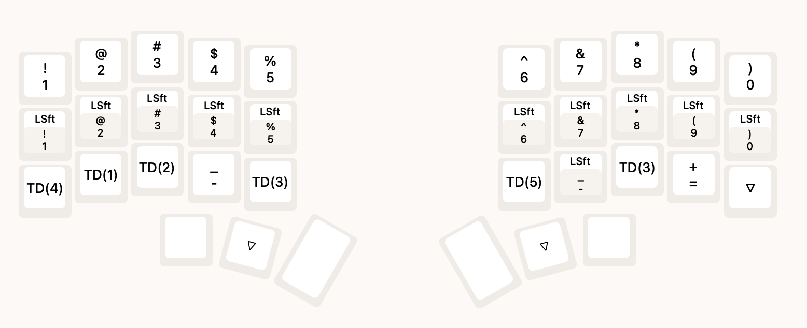

# 3w6hs

## Spec

A modified version of 3W6 (based on the design by weteor)

- low profile
- split ortholinear keyboard with 36 keys
- onboard RP2040 controller with 16MB flash memory
- Kailh Choc v1 Hotswap Sockets (with Kailh gChoc 20g/f switches)
- ESD protection
- VIAL firmware

## Layout

**Base layer**

**Layer 2 (Numericals/Special characters)**

Tap Dance commands:
- TD(1) - Brackets `[]` (Single tap - left, double tap - right);
- TD(2) - Braces `{}` (Single tap - left, double tap - right);
- TD(3) - Quotes (Single tap - double quote, hold - single quote);
- TD(4) - Backtick/tilde (Single tap - backtick, hold - tilde);
- TD(5) - Backslash/pipe (Single tap - backslash, hold - pipe).
  
**Layer 3 (Arrows, Commands and Macros)**

Tap Dance commands:
- TD(0) - Music player (Single tap - next track, double tap - previous track, hold - play/pause).

Macro commands:
- M0 - Take a screenshot and save to a file;
- M1 - Take a screenshot and save to the clipboard;
- M2 - Next tab (browser/terminal);
- M3 - Previous tab (browser/terminal);
- M4 - `gt` (next tab for nvim);
- M5 - `gT` (previous tab for nvim);
- M6 - `Cmd + Space` (Spotlight).

**Layer 4 (Functions, Numpad)**

## Links

- https://showcase.beekeeb.com/3w6hs-split-keyboard/
