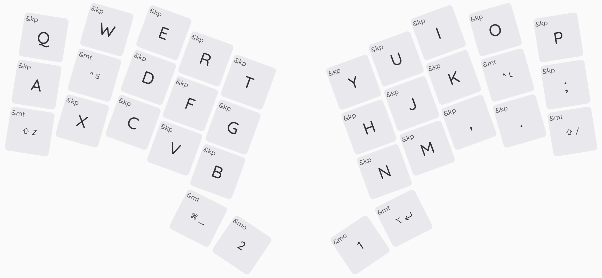
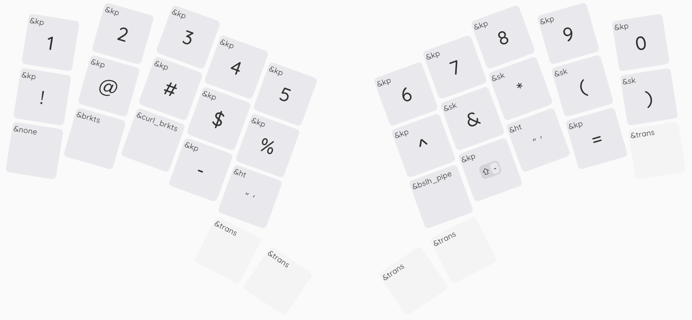
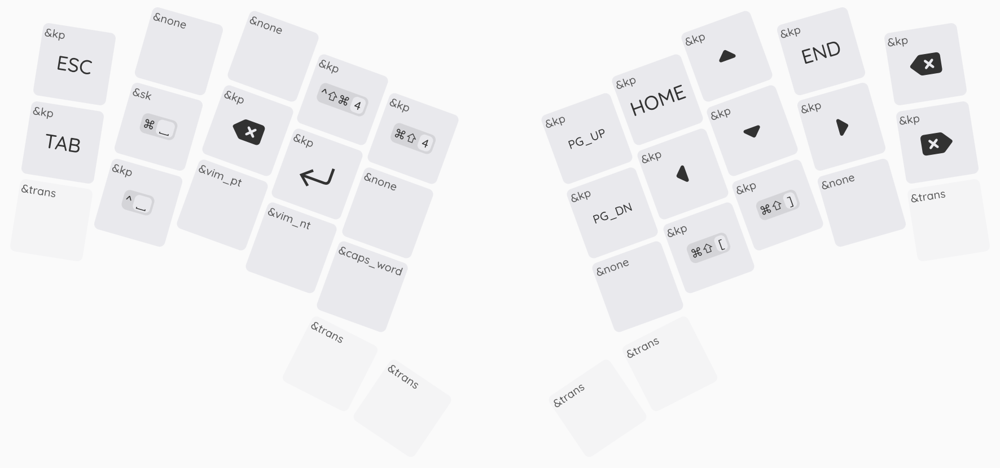
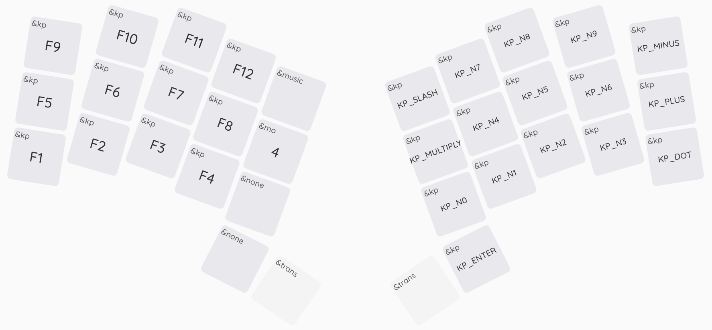

# re-gret

## Spec

- low profile unibody
- wireless
- ortholinear keyboard with splay and 34 keys
- Seeed Studio XIAO nRF52840
- Kailh Choc v1 Hotswap Sockets (with Kailh Nocturnal (silent) 20g/f switches)
- ZMK Firmware

## Layout

**Base layer**

Mod hold-tap keys:
- Tap: S, Mod: Left Ctrl;
- Tap: L, Mod: Right Ctrl;
- Tap: Z, Mod: Left Shift;
- Tap: /, Mod: Right Shift;
- Tap: Space, Mod: Cmd;
- Tap: Enter, Mod: Opt.

**Symbols layer**

Tap Dance keys:
- &brkts - Brackets `[]` (Single tap - left, double tap - right);
- &curl_brkts - Braces `{}` (Single tap - left, double tap - right);
- &blsh_pipe - Backslash/pipe (Single tap - backslash, double tap - pipe);

Hold-tap keys:
- Quotes (Single tap - double quote, hold - single quote);
- Backtick/tilde (Single tap - backtick, hold - tilde);

**Navigation layer**

Macro commands:
- vim_pt - previous tab (`gT` sequence);
- vim_nt - next tab (`gt` sequence);

Combinations:
- Shift+Cmd+Ctrl+4 - Take a screenshot and save to the clipboard;
- Shift+Cmd+4 - Take a screenshot and save to the file;
- Cmd+Shift+`[` - Previous tab (browser/terminal);
- Cmd+Shift+`]` - Next tab (browser/terminal);
- Cmd+Space - (Spotlight).

**Functions layer**

Tap Dance commands:
- &music - Music controls (Single tap - play/pause, double tap - next track, triple tap - previous track).

## Links

- https://github.com/rschenk/re-gret
- https://github.com/burningalchemist/zmk-config
