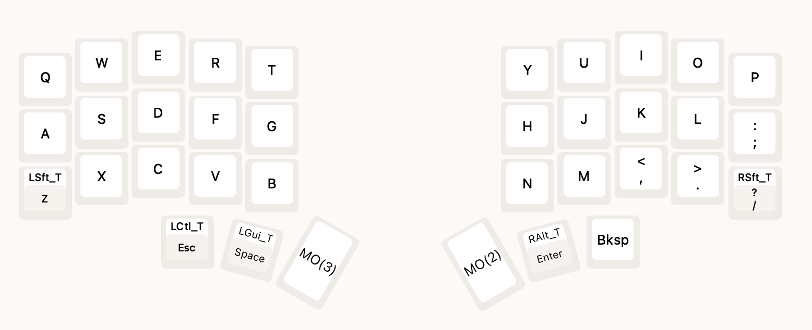
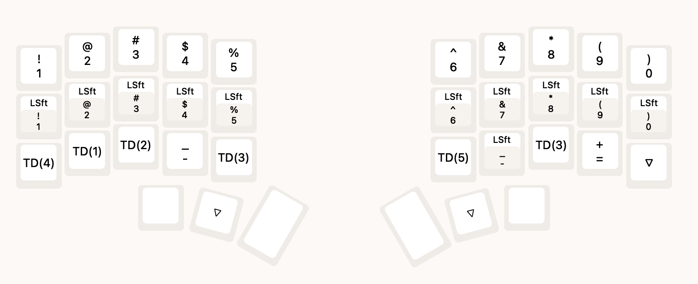
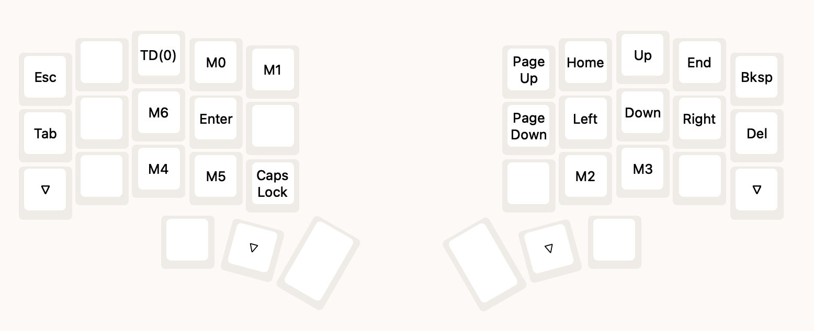
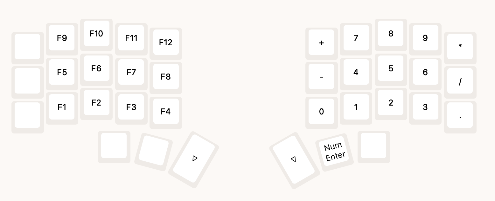

# 3w6hs

## Spec

A modified version of 3W6 (based on the design by weteor)

- low profile
- split ortholinear keyboard with 36 keys
- onboard RP2040 controller with 16MB flash memory
- Kailh Choc v1 Hotswap Sockets (with Kailh gChoc 20g/f switches)
- ESD protection
- VIAL firmware

## Layout

## Links

- https://showcase.beekeeb.com/3w6hs-split-keyboard/
